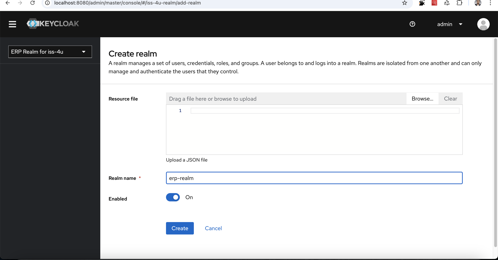
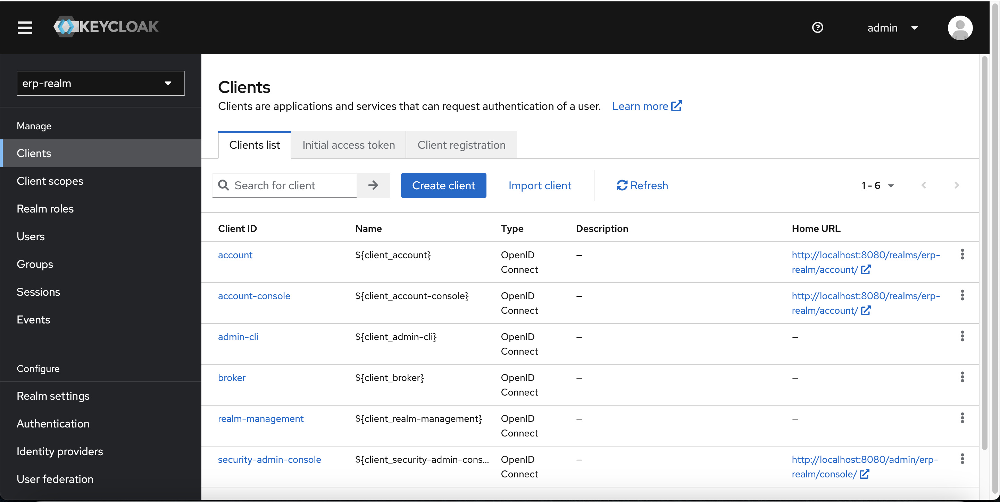
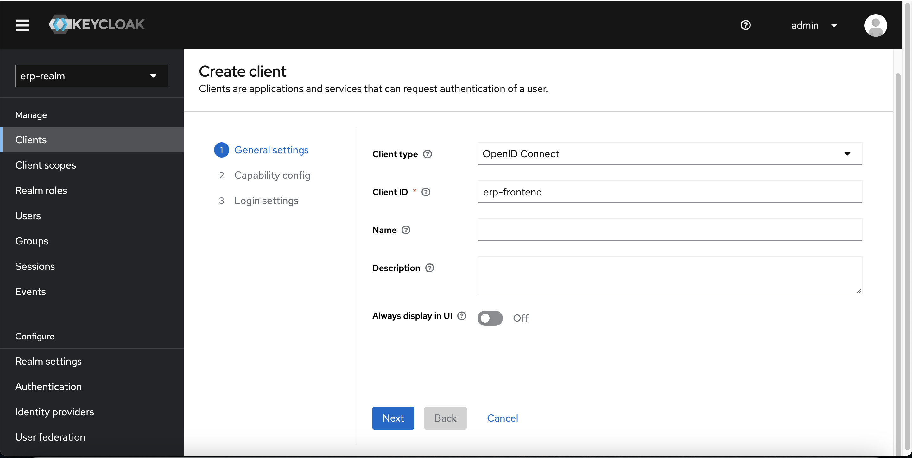
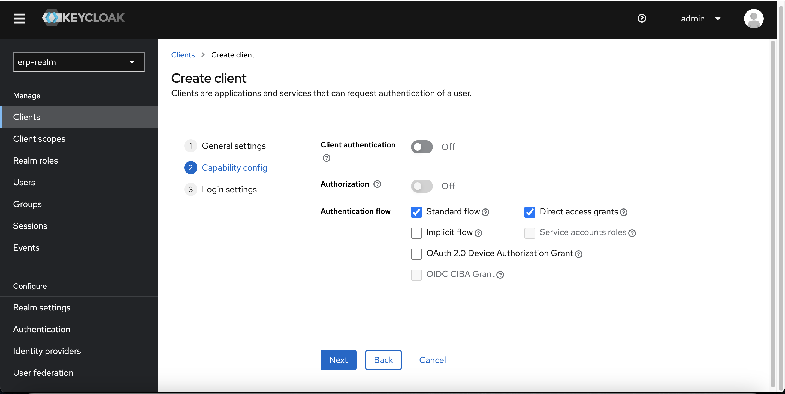
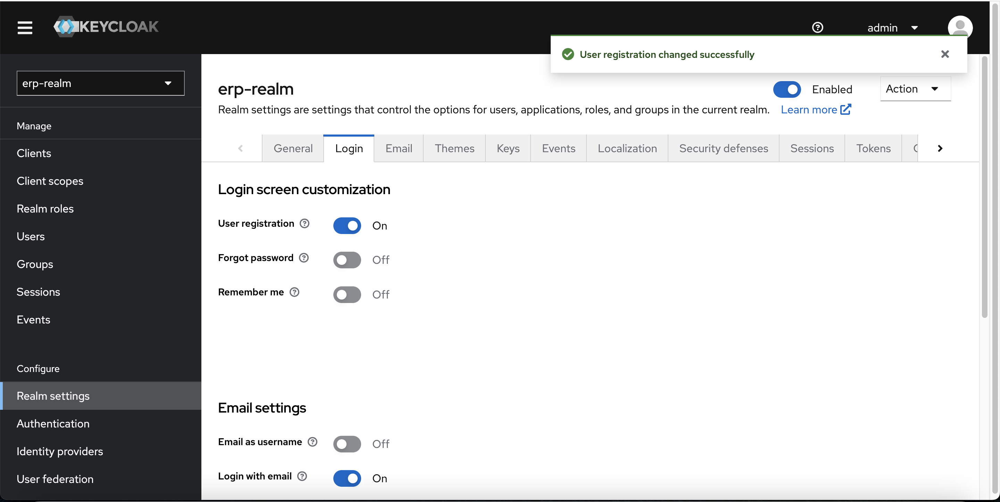

# ERP Application

Application ERP microservices développée avec Spring Boot et Spring Cloud.

## 🏗️ Architecture

L'application est composée de plusieurs microservices :

| Service | Port | Description |
|---------|------|-------------|
| erp-service-discovery | 8013 | Eureka Server - Service de découverte |
| erp-config | 8012 | Config Server - Configuration centralisée |
| erp-api-gateway | 8014 | API Gateway - Point d'entrée unique |
| erp-user-service | 8055 | Gestion des utilisateurs |
| erp-product-service | 8051 | Gestion des produits |
| erp-inventory-service | 8059 | Gestion des stocks |
| erp-supplier-service | 8052 | Gestion des fournisseurs |
| erp-order-service | 8053 | Gestion des commandes |
| erp-client-service | 8058 | Gestion des clients |
| erp-payment-service | 8069 | Gestion des paiements |
| erp-billing-service | 8057 | Facturation |
| erp-sales-service | 8089 | Ventes |
| erp-dashboard-service | 8065 | Tableau de bord |
| erp-scheduler-service | 8066 | Planification |
| keycloak | 8092 | Authentification et autorisation |
| mysql | 3306 | Base de données |

## 🚀 Démarrage rapide avec Docker

### Prérequis

- Docker et Docker Compose installés
- Java 17 (pour le build Maven)
- Maven 3.6+

## 🏷️ Build et Déploiement avec Versioning

Le projet utilise un système de versioning automatique basé sur les propriétés Maven `${revision}${changelist}` pour le tagging des images Docker.

### Script de Build et Déploiement

Le script `build-and-deploy.sh` utilise la configuration de production (`docker-compose.prod.yml`) et permet de builder et déployer tous les services avec un versioning automatique :

```bash
# Build tous les services avec versioning automatique
./build-and-deploy.sh build

# Build un service spécifique avec versioning
./build-and-deploy.sh erp-user-service build

# Démarrer tous les services
./build-and-deploy.sh up

# Démarrer un service spécifique
./build-and-deploy.sh erp-user-service up

# Arrêter tous les services
./build-and-deploy.sh down

# Voir les logs d'un service
./build-and-deploy.sh logs erp-user-service

# Redémarrer un service
./build-and-deploy.sh erp-user-service restart
```

> **Note** : Le script utilise automatiquement `docker-compose.prod.yml` qui inclut tous les services ERP avec des configurations optimisées pour la production (health checks, restart policies, etc.).

### Versioning Automatique

#### Configuration Maven
Le versioning est configuré dans le POM parent :
```xml
<properties>
    <revision>1.0.0</revision>
    <changelist>-SNAPSHOT</changelist>
</properties>
```

#### Images Docker Versionnées
Toutes les images Docker sont automatiquement taggées avec la version Maven :
- **Version actuelle** : `1.0.0-SNAPSHOT`
- **Format des tags** : `{service-name}:{revision}{changelist}`
- **Exemples** :
  - `erp-user-service:1.0.0-SNAPSHOT`
  - `erp-product-service:1.0.0-SNAPSHOT`
  - `erp-api-gateway:1.0.0-SNAPSHOT`

#### Mise à jour de Version
Pour changer la version, modifiez les propriétés dans `pom.xml` :
```xml
<properties>
    <revision>2.0.0</revision>
    <changelist></changelist>  <!-- Version finale -->
</properties>
```

### Fonctionnalités du Script

#### Extraction Automatique de Version
Le script extrait automatiquement la version depuis Maven :
```bash
# Extraction de la version
revision=$(mvn help:evaluate -Dexpression=revision -q -DforceStdout)
changelist=$(mvn help:evaluate -Dexpression=changelist -q -DforceStdout)
version="${revision}${changelist}"
```

#### Build avec Versioning
- **Maven Build** : Compile tous les services avec la version actuelle
- **Docker Build** : Crée les images avec les tags de version appropriés
- **JAR Files** : Utilise les JAR files versionnés dans les images Docker
- **Configuration Production** : Utilise `docker-compose.prod.yml` avec tous les services ERP

#### Ports de Production
Les services utilisent les ports de production suivants :
- **Keycloak** : 8092
- **MySQL** : 3306
- **Service Discovery** : 8013
- **Config Service** : 8012
- **API Gateway** : 8014
- **User Service** : 8055
- **Product Service** : 8051
- **Inventory Service** : 8059
- **Supplier Service** : 8052
- **Order Service** : 8053
- **Client Service** : 8058
- **Payment Service** : 8069
- **Billing Service** : 8057
- **Sales Service** : 8060
- **Dashboard Service** : 8065
- **Scheduler Service** : 8066

#### Services Supportés
Tous les services ERP sont supportés :
- `erp-service-discovery`
- `erp-config`
- `erp-api-gateway`
- `erp-user-service`
- `erp-product-service`
- `erp-inventory-service`
- `erp-supplier-service`
- `erp-order-service`
- `erp-client-service`
- `erp-payment-service`
- `erp-billing-service`
- `erp-sales-service`
- `erp-dashboard-service`
- `erp-scheduler-service`

### Exemples d'Utilisation

#### Build Complet
```bash
# Build tous les services avec versioning
./build-and-deploy.sh build
# Résultat : Toutes les images sont taggées avec 1.0.0-SNAPSHOT
```

#### Build d'un Service Spécifique
```bash
# Build seulement le service utilisateur
./build-and-deploy.sh erp-user-service build
# Résultat : erp-user-service:1.0.0-SNAPSHOT
```

#### Déploiement
```bash
# Démarrer tous les services versionnés
./build-and-deploy.sh up
# Résultat : Tous les services utilisent les images versionnées
```

#### Gestion des Logs
```bash
# Voir les logs de tous les services
./build-and-deploy.sh logs

# Voir les logs d'un service spécifique
./build-and-deploy.sh logs erp-user-service
```

### Configuration de la Base de Données

Le service `erp-billing-service` est configuré avec sa propre base de données :

#### Base de Données Billing
- **Nom de la base** : `billing_db`
- **Utilisateur** : `billing_prd`
- **Mot de passe** : Configurable via `DB_PASSWORD`
- **URL de connexion** : `jdbc:mysql://mysql:3306/billing_db?useSSL=false&serverTimezone=UTC`

#### Initialisation Automatique
La base de données `billing_db` et l'utilisateur `billing_prd` sont créés automatiquement lors du premier démarrage de MySQL via le script `init-scripts/01-create-billing-db.sql`.

#### Variables d'Environnement
Les variables d'environnement sont centralisées dans `docker-compose.env` :
```bash
# Configuration de la base de données
DB_PASSWORD=billing_password

# Configuration Eureka
EUREKA_URL=http://erp-service-discovery:8013/eureka/

# Configuration Spring Cloud Config
SPRING_CLOUD_CONFIG_URI=http://erp-config:8012

# Profil Spring
SPRING_PROFILES_ACTIVE=prd
```

#### Résolution des Problèmes Git
Le service de configuration a été configuré pour éviter les problèmes de permissions Git :
- **Répertoires Git** : Créés automatiquement dans le Dockerfile
- **Permissions** : Configurées correctement pour l'utilisateur `appuser`
- **Configuration Git** : Désactivée si nécessaire via `SPRING_CLOUD_CONFIG_SERVER_GIT_DEFAULT_LABEL`

### Avantages du Versioning

1. **Traçabilité** : Chaque déploiement est identifié par sa version
2. **Rollback** : Possibilité de revenir à une version précédente
3. **Cohérence** : Tous les services utilisent la même version
4. **Automatisation** : Pas besoin de gérer manuellement les versions
5. **Intégration Maven** : Utilise directement les propriétés Maven existantes
6. **Configuration Centralisée** : Variables d'environnement dans `docker-compose.env`

## 🏠 Développement (docker-compose.yml)

Configuration simple pour le développement avec seulement Keycloak et MySQL.

### 1. Démarrage des services de base de données et keycloak

```bash
# Démarrer Keycloak et MySQL
docker-compose up -d

# Voir les logs
docker-compose logs -f

# Arrêter les services
docker-compose down
```

## 🏭 Production (docker-compose.prod.yml)

Configuration complète pour la production avec tous les microservices.

### 1. Build et démarrage de tous les services

```bash
# Build tous les services pour la production
./deploy-prod.sh build

# Démarrer tous les services en mode production
./deploy-prod.sh up

# Arrêter tous les services en mode production
docker-compose down
```

### 2. Gestion des services de production

```bash
# Vérifier les images Docker requises
./deploy-prod.sh check

# Voir le statut des services
./deploy-prod.sh status

# Voir les logs de tous les services
./deploy-prod.sh logs

# Voir les logs d'un service spécifique
./deploy-prod.sh logs erp-user-service

# Redémarrer un service
./deploy-prod.sh erp-user-service restart

# Arrêter tous les services
./deploy-prod.sh down
```

### 3. Commandes Docker Compose directes pour la production

```bash
# Build tous les services
docker-compose -f docker-compose.prod.yml build

# Démarrer tous les services
docker-compose -f docker-compose.prod.yml up -d

# Voir les logs
docker-compose -f docker-compose.prod.yml logs -f

# Arrêter tous les services
docker-compose -f docker-compose.prod.yml down
```

## 🔧 Configuration

### Variables d'environnement

Chaque service utilise le profil Spring `docker` et est configuré pour :
- Se connecter à Eureka (Service Discovery)
- Utiliser le Config Service centralisé
- Se connecter à la base de données MySQL

### Réseau

Tous les services sont connectés au réseau `spring_network` pour permettre la communication inter-services.

### Dépendances

Les services sont configurés avec les bonnes dépendances :
- MySQL est démarré en premier
- Service Discovery et Config Service sont démarrés avant les autres services
- Les services métier dépendent de Service Discovery, Config Service et MySQL

## 📁 Structure du projet

```
ERP-App/
├── erp-api-gateway/          # API Gateway
├── erp-service-discovery/    # Service Discovery (Eureka)
├── erp-config/              # Config Server
├── erp-user-service/        # Service utilisateurs
├── erp-product-service/     # Service produits
├── erp-inventory-service/   # Service stocks
├── erp-supplier-service/    # Service fournisseurs
├── erp-order-service/       # Service commandes
├── erp-client-service/      # Service clients
├── erp-payment-service/     # Service paiements
├── erp-billing-service/     # Service facturation
├── erp-sales-service/       # Service ventes
├── erp-dashboard-service/   # Service tableau de bord
├── erp-scheduler-service/   # Service planification
├── erp-common/             # Bibliothèque commune
├── utils-lib/              # Utilitaires
├── Dockerfile              # Dockerfile commun
├── docker-compose.yml      # Configuration Docker Compose
├── build-and-deploy.sh     # Script d'aide
└── README.md              # Ce fichier
```

## 🐳 Configuration Docker

### Dockerfile commun

Le projet utilise un Dockerfile commun qui :
- Utilise une approche multi-stage (Maven + OpenJDK 17)
- Optimise la taille des images
- Utilise un utilisateur non-root pour la sécurité
- Supporte la configuration flexible avec variables d'environnement

### Configurations Docker Compose

#### 🏠 Développement (`docker-compose.yml`)
- **Services** : Keycloak + MySQL uniquement
- **Usage** : Développement local simple
- **Ports** : Keycloak (8080), MySQL (3306)
- **Réseau** : spring_network
- **Volumes** : mysql_data

#### 🏭 Production (`docker-compose.prod.yml`)
- **Services** : Tous les microservices ERP
- **Usage** : Déploiement en production
- **Ports** : Tous les services (8013-8014, 8051-8053, 8055, 8057-8059, 8060, 8065-8066, 8069)
- **Réseau** : spring_network
- **Volumes** : mysql_data_prod
- **Fonctionnalités** :
  - Health checks pour tous les services
  - Restart policy (unless-stopped)
  - Configuration mémoire optimisée
  - Profil Spring `prod`
  - Noms de conteneurs avec suffixe `-prod`

### Architecture Docker

#### Réseau
Tous les services sont connectés au réseau `spring_network` pour permettre la communication inter-services.

**Développement** :
- MySQL est démarré en premier
- Keycloak peut être démarré indépendamment

**Production** :
- MySQL est démarré en premier
- Service Discovery et Config Service sont démarrés avant les autres services
- Les services métier dépendent de Service Discovery, Config Service et MySQL

### Fonctionnalités de Production

#### Health Checks
Tous les services de production incluent des health checks :
```yaml
healthcheck:
  test: ["CMD", "curl", "-f", "http://localhost:8081/actuator/health"]
  interval: 30s
  timeout: 10s
  retries: 3
```

#### Restart Policy
Tous les services utilisent la politique `unless-stopped` :
```yaml
restart: unless-stopped
```

## 🔄 Politique de Redémarrage Docker (RESTART_POLICY)

La politique de redémarrage des conteneurs Docker est configurable via la variable d'environnement `RESTART_POLICY` dans `docker-compose.env`.

### Valeurs possibles

| Valeur | Description | Comportement |
|--------|-------------|--------------|
| `no` | **Par défaut** | Ne redémarre jamais le conteneur automatiquement |
| `always` | **Toujours** | Redémarre le conteneur s'il s'arrête, même s'il a été arrêté manuellement |
| `unless-stopped` | **Sauf si arrêté** | Redémarre le conteneur s'il s'arrête, sauf s'il a été arrêté explicitement |
| `on-failure` | **En cas d'échec** | Redémarre le conteneur seulement s'il s'arrête avec un code de sortie non-zéro |

### Configuration

#### Dans docker-compose.env
```bash
# Politique de redémarrage des conteneurs
RESTART_POLICY=unless-stopped
```

#### Dans docker-compose.prod.yml
```yaml
services:
  erp-user-service:
    # ... autres configurations
    restart: ${RESTART_POLICY:-unless-stopped}
```

### Utilisation recommandée

#### 🏠 Développement
```bash
# Dans docker-compose.env pour le développement
RESTART_POLICY=no
```
- **Avantage** : Les conteneurs ne redémarrent pas automatiquement
- **Usage** : Idéal pour le développement et les tests

#### 🏭 Production
```bash
# Dans docker-compose.env pour la production
RESTART_POLICY=unless-stopped
```
- **Avantage** : Redémarre automatiquement en cas de crash
- **Usage** : Idéal pour la production et la haute disponibilité

#### 🔧 Maintenance
```bash
# Pour les services critiques
RESTART_POLICY=always
```
- **Avantage** : Redémarre même après un arrêt manuel
- **Usage** : Services critiques nécessitant une disponibilité maximale

#### 🐛 Debug
```bash
# Pour le debugging
RESTART_POLICY=on-failure
```
- **Avantage** : Redémarre seulement en cas d'erreur
- **Usage** : Idéal pour identifier les problèmes de démarrage

### Exemples d'utilisation

#### Changer la politique pour tous les services
```bash
# Modifier docker-compose.env
echo "RESTART_POLICY=always" >> docker-compose.env

# Redémarrer les services
docker-compose -f docker-compose.prod.yml --env-file docker-compose.env up -d
```

#### Vérifier la politique actuelle
```bash
# Voir la configuration des conteneurs
docker-compose -f docker-compose.prod.yml --env-file docker-compose.env config

# Voir le statut des conteneurs
docker-compose -f docker-compose.prod.yml --env-file docker-compose.env ps
```

#### Tester une politique différente
```bash
# Tester avec une politique temporaire
RESTART_POLICY=no docker-compose -f docker-compose.prod.yml --env-file docker-compose.env up -d

# Vérifier que les conteneurs ne redémarrent pas
docker-compose -f docker-compose.prod.yml --env-file docker-compose.env restart erp-user-service
```

### Bonnes pratiques

1. **Production** : Utilisez `unless-stopped` pour la plupart des services
2. **Services critiques** : Utilisez `always` pour les services essentiels
3. **Développement** : Utilisez `no` pour éviter les redémarrages intempestifs
4. **Debug** : Utilisez `on-failure` pour identifier les problèmes de démarrage
5. **Maintenance** : Changez temporairement vers `no` pendant les mises à jour

### Impact sur les performances

| Politique | Impact CPU | Impact Mémoire | Disponibilité |
|-----------|------------|----------------|---------------|
| `no` | Faible | Faible | Faible |
| `on-failure` | Faible | Faible | Moyenne |
| `unless-stopped` | Moyen | Moyen | Élevée |
| `always` | Élevé | Élevé | Très élevée |

### Dépannage

#### Le conteneur ne redémarre pas
```bash
# Vérifier la politique
docker inspect <container_name> | grep -i restart

# Vérifier les logs
docker logs <container_name>

# Redémarrer manuellement
docker restart <container_name>
```

#### Le conteneur redémarre en boucle
```bash
# Arrêter le conteneur
docker stop <container_name>

# Changer la politique vers 'no'
echo "RESTART_POLICY=no" > docker-compose.env

# Redémarrer
docker-compose -f docker-compose.prod.yml --env-file docker-compose.env up -d
```

#### Configuration Mémoire
Optimisation JVM pour la production :
```yaml
environment:
  JAVA_OPTS: "-Xmx1024m -Xms512m"
```

#### Noms de Conteneurs
Les conteneurs de production ont un suffixe `-prod` pour éviter les conflits :
- `erp-user-service-prod`
- `mysql_db_prod`
- etc.

## 📊 Comparaison des Environnements

| Aspect | Développement | Production |
|--------|---------------|------------|
| **Services** | Keycloak + MySQL | Tous les microservices |
| **Complexité** | Simple | Complète |
| **Ports** | 2 ports | 16 ports |
| **Health Checks** | Non | Oui |
| **Restart Policy** | Non | Oui |
| **Optimisation** | Basique | Avancée |
| **Monitoring** | Basique | Complet |
| **Usage** | Développement local | Déploiement production |

## 🔄 Migration entre Environnements

### Du Développement vers la Production

1. **Arrêter l'environnement de développement** :
   ```bash
   docker-compose down
   ```

2. **Démarrer l'environnement de production** :
   ```bash
   ./deploy-prod.sh build
   ./deploy-prod.sh up
   ```

3. **Vérifier le statut** :
   ```bash
   ./deploy-prod.sh status
   ```

### De la Production vers le Développement

1. **Arrêter l'environnement de production** :
   ```bash
   ./deploy-prod.sh down
   ```

2. **Démarrer l'environnement de développement** :
   ```bash
   docker-compose up -d
   ```

3. **Vérifier le statut** :
   ```bash
   docker-compose ps
   ```

## 🔍 Dépannage

### Vérifier l'état des services

#### Développement
```bash
docker-compose ps
```

#### Production
```bash
docker-compose -f docker-compose.prod.yml ps
# ou
./deploy-prod.sh status
```

### Voir les logs d'un service

#### Développement
```bash
docker-compose logs keycloak
docker-compose logs mysql
```

#### Production
```bash
docker-compose -f docker-compose.prod.yml logs erp-user-service
# ou
./deploy-prod.sh logs erp-user-service
```

### Redémarrer un service

#### Développement
```bash
docker-compose restart keycloak
```

#### Production
```bash
docker-compose -f docker-compose.prod.yml restart erp-user-service
# ou
./deploy-prod.sh erp-user-service restart
```

### Nettoyer les conteneurs et images

#### Développement
```bash
# Arrêter et supprimer les conteneurs
docker-compose down

# Supprimer les images
docker-compose down --rmi all

# Nettoyer complètement
docker-compose down --rmi all --volumes --remove-orphans
```

#### Production
```bash
# Arrêter et supprimer les conteneurs
docker-compose -f docker-compose.prod.yml down

# Supprimer les images
docker-compose -f docker-compose.prod.yml down --rmi all

# Nettoyer complètement
docker-compose -f docker-compose.prod.yml down --rmi all --volumes --remove-orphans
```

## 🔐 Authentification avec Keycloak

### Installation Keycloak sur Windows

Pour installer Keycloak sur Windows, référez-vous à [ce lien](https://medium.com/@awosolat/how-to-install-keycloak-17-on-windows-machine-b2830503751f).

Pour démarrer le serveur Keycloak :

```bash
kc.bat start-dev
```

Puis visitez le serveur à l'adresse : [http://localhost:8092/](http://localhost:8080/)

### Configuration Keyclock en Docker

Keycloak est automatiquement configuré dans Docker Compose avec :
- Port : 8080
- Admin : `admin` / `passw0rd`
- Import automatique du realm

### Configuration Manuelle de Keycloak (Procédure de contournement)

Si l'import automatique du realm ne fonctionne pas au démarrage, vous pouvez configurer Keycloak manuellement en suivant ces étapes :

#### 1. Accès à l'Administration Keycloak

1. **Démarrer Keycloak** :
   ```bash
   docker-compose up -d keycloak
   ```

2. **Accéder à l'interface d'administration** :
   - URL : [http://localhost:8080/](http://localhost:8080/)
   - Identifiants : `admin` / `passw0rd`

#### 2. Création du Realm

1. **Créer un nouveau realm** :
   - Cliquer sur le dropdown "`Master`" en haut à gauche
   - Sélectionner "`Create Realm`"
   - Nommer le realm (ex: "`erp-realm`")
   - Cliquer sur "`Create`"

   

#### 3. Configuration du Client

1. **Créer un client** :
   - Dans le menu de gauche, aller dans "`Clients`"
   - Cliquer sur "`Create`"
   - Remplir les informations du client :
     - **Client ID** : `erp-client`
     - **Client Protocol** : `openid-connect`
     - **Root URL** : `http://localhost:4200` (ou votre URL frontend)
   - Cliquer sur "`Save`"

   

2. **Configurer les paramètres du client** :
   - **Access Type** : `confidential`
   - **Standard Flow Enabled** : `ON`
   - **Direct Access Grants Enabled** : `ON`
   - **Valid Redirect URIs** : `http://localhost:4200/*`
   - **Web Origins** : `http://localhost:4200`

#### 4. Configuration des Paramètres Généraux

1. **Paramètres du realm** :
   - Aller dans "Realm Settings" > "General"
   - Configurer les paramètres de base :
     - **Display Name** : `ERP Application`
     - **HTML Display Name** : `ERP Application`
     - **Frontend URL** : `http://localhost:4200`

   

#### 5. Configuration des Capacités

1. **Paramètres de sécurité** :
   - Aller dans "Realm Settings" > "Security Defenses"
   - Configurer les paramètres de sécurité :
     - **Brute Force Detection** : `ON`
     - **Password Policy** : Configurer selon vos besoins
     - **Login** : Configurer les tentatives de connexion

   

#### 6. Configuration de la Connexion

1. **Paramètres de connexion** :
   - Aller dans "Realm Settings" > "Login"
   - Configurer les options de connexion :
     - **User registration** : `ON` (si vous voulez permettre l'inscription)
     - **Forgot password** : `ON`
     - **Remember me** : `ON`
     - **Verify email** : `ON` (optionnel)

   

#### 7. Activation de l'Inscription

1. **Activer l'inscription des utilisateurs** :
   - Aller dans "Realm Settings" > "Login"
   - Activer "User registration"
   - Configurer les champs requis pour l'inscription
   - Sauvegarder les modifications



#### 8. Création d'Utilisateurs

1. **Créer des utilisateurs de test** :
   - Aller dans "Users" dans le menu de gauche
   - Cliquer sur "Add user"
   - Remplir les informations :
     - **Username** : `testuser`
     - **Email** : `test@example.com`
     - **First Name** : `Test`
     - **Last Name** : `User`
   - Aller dans l'onglet "Credentials" pour définir un mot de passe

#### 9. Configuration des Rôles

1. **Créer des rôles** :
   - Aller dans "Realm Roles" dans le menu de gauche
   - Créer des rôles selon vos besoins :
     - `ADMIN` : Administrateur système
     - `USER` : Utilisateur standard
     - `MANAGER` : Gestionnaire
   - Assigner les rôles aux utilisateurs créés

#### 10. Test de la Configuration

1. **Tester la connexion** :
   - Aller sur [http://localhost:8092/realms/erp-realm/account](http://localhost:8092/realms/erp-realm/account)
   - Tenter de se connecter avec les identifiants créés
   - Vérifier que la redirection fonctionne correctement

#### Variables d'Environnement pour l'Application

Une fois Keycloak configuré, mettez à jour les variables d'environnement de votre application :

```bash
# Configuration Keycloak
KEYCLOAK_URL=http://localhost:8092
KEYCLOAK_REALM=erp-realm
KEYCLOAK_CLIENT_ID=erp-client
KEYCLOAK_CLIENT_SECRET=<votre-client-secret>
```

#### Dépannage

Si vous rencontrez des problèmes :

1. **Vérifier les logs Keycloak** :
   ```bash
   docker-compose logs keycloak
   ```

2. **Vérifier la configuration du client** :
   - S'assurer que les URLs de redirection sont correctes
   - Vérifier que le client est bien configuré en mode "confidential"

3. **Tester la connexion** :
   - Utiliser l'outil de test intégré de Keycloak
   - Vérifier les tokens JWT générés

#### Sauvegarde de la Configuration

Pour sauvegarder votre configuration Keycloak :

```bash
# Export complet du realm (avec utilisateurs)
docker exec -it keycloak /opt/keycloak/bin/kc.sh export --dir /opt/keycloak/data/export --realm erp-realm --users realm_file

# Le résultat: Un fichier sera créé dans le conteneur :
/opt/keycloak/data/export/erp-realm-realm.json

# Récupérer le fichier exporté sur ta machine
docker cp keycloak:/opt/keycloak/data/export/erp-realm-realm.json ./.keycloak/erp-realm-export.json
```

## 📚 Documentation supplémentaire

- [Configuration des services](erp-config/src/main/resources/)

## 🛠️ Développement

### Build Maven

```bash
# Build complet
mvn clean package

# Build d'un service spécifique
mvn clean package -pl erp-user-service

# Build sans tests
mvn clean package -DskipTests
```

### Tests

```bash
# Tests unitaires
mvn test

# Tests d'intégration
mvn verify
```

## 📝 Notes importantes

1. **Conflit de ports** : L'API Gateway utilise le port 8014, Keycloak utilise le port 8092.

2. **Base de données** : MySQL est configuré avec des données persistantes via un volume Docker.

3. **Service Discovery** : Eureka doit être démarré avant les autres services pour la découverte de services.

4. **Configuration** : Le Config Service doit être démarré avant les services qui en dépendent.

5. **Ressources** : Assurez-vous d'avoir suffisamment de ressources système pour faire tourner tous les services simultanément.

## 🤝 Contribution

1. Fork le projet
2. Créez une branche pour votre fonctionnalité (`git checkout -b feature/AmazingFeature`)
3. Committez vos changements (`git commit -m 'Add some AmazingFeature'`)
4. Push vers la branche (`git push origin feature/AmazingFeature`)
5. Ouvrez une Pull Request